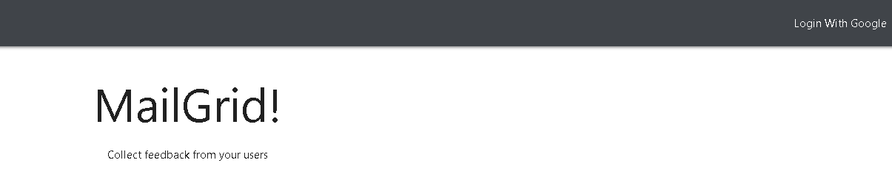

# MailGrid

MailGrid is a React application that allows business owners to send out mass survey campaigns via email and receive real feedback from their customers! Once a survey campaign is successfully created it will render to the Dashboard, where user can see all of their active campaigns and get a better idea of what products their customers like and don't like.

## Demo

### Start off by signing into MailGrid with your associated Gmail Account!

Once logged in, you will be redirected to your User Dashboard!

### Adding Credits 

Before you fill out a survey, you must add credits to your account.

### Creating a Survey Campaign

To create a survey, click on the red button in the bottom left hand corner.Once you're done creating a survey, you will be redirected to a page to review it. After you confirm your survey inputs, your new campaign will be displayed in the user dashboard.

**Keep in mind that once the survey is sent out, you will not be able to edit it!**

### Tracking Survey Responses

Everytime one of your recipients responds to your survey, you will be able to see if they responded with yes or no, almost immediately after they click the link.

